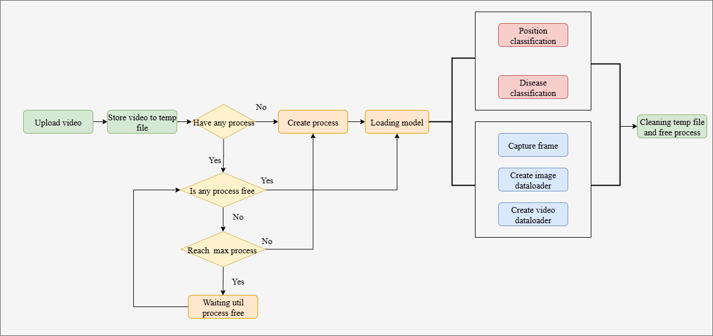
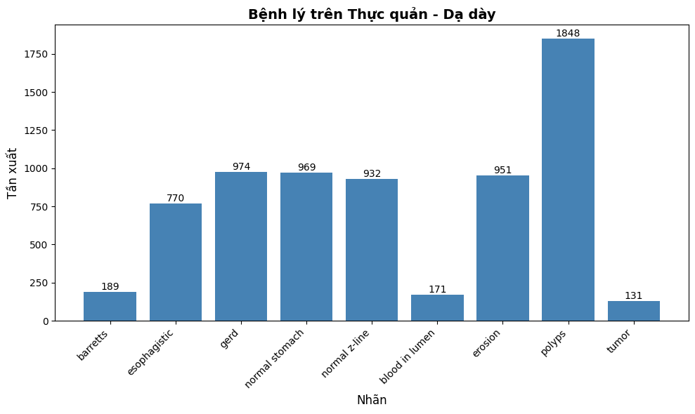
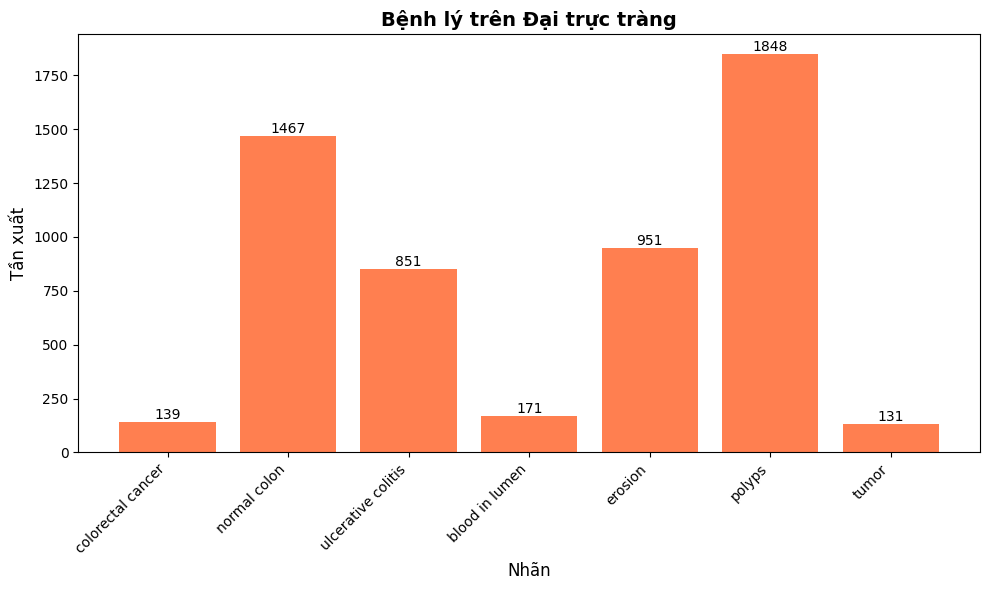
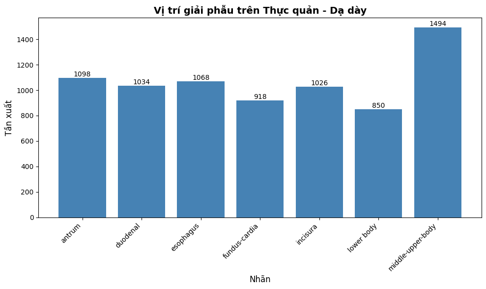
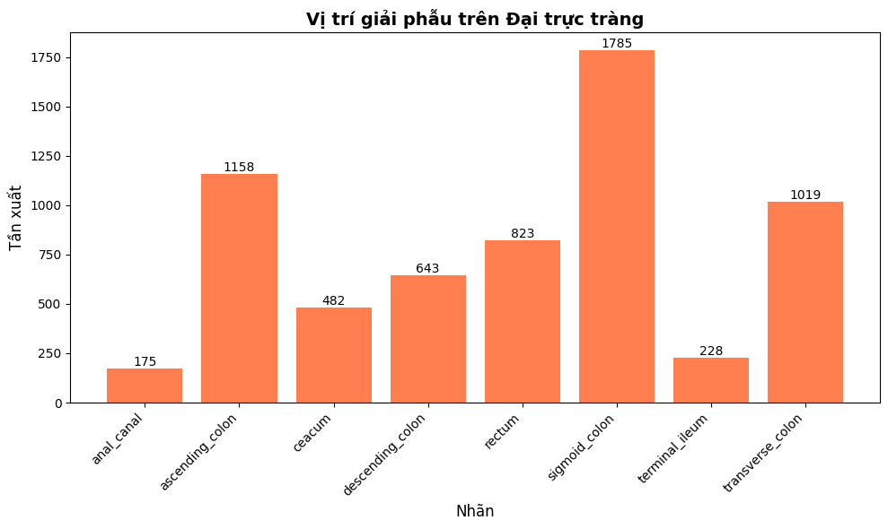
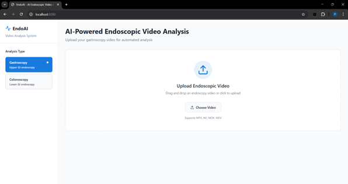
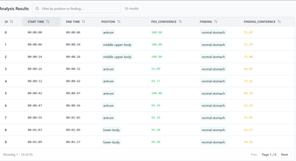
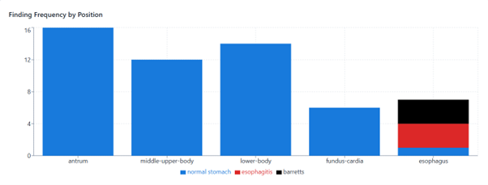

# 🏥 AI System for Gastrointestinal Disease Diagnosis

> An intelligent system for analyzing endoscopy videos to detect pathologies and identify anatomical locations in near real-time.

---

## 📋 Table of Contents

- [Introduction](#introduction)
- [Solution & Features](#solution--features)
- [Methodology](#methodology)
- [Datasets](#datasets)
- [Experimental Results](#experimental-results)
- [Installation & Usage](#installation--usage)
- [Demo](#demo)

---

## Introduction

This project develops an **Artificial Intelligence (AI) system** to assist doctors during gastrointestinal endoscopy procedures. The system automatically analyzes endoscopy videos to:
- 🔍 Detect gastrointestinal pathologies in real-time
- 📍 Identify anatomical locations of the endoscope
- ⚡ Provide near real-time analysis

## Solution & Features

The system performs automated analysis of endoscopy videos with two key capabilities:

| Feature | Description |
|---------|------------|
| **🎯 Pathology Classification** | Detects lesions such as polyps, ulcers, and other abnormalities |
| **📍 Anatomical Location Classification** | Identifies endoscope position (Esophagus, Stomach, Colorectum, etc.) |

### System Workflow



---

## Methodology

### Model Architecture

**Vision Transformer (ViT Small)** backbone with the following specifications:

| Parameter | Value |
|-----------|-------|
| Model Type | Vision Transformer (ViT Small) |
| Hidden Size | 384 |
| Attention Heads | 6 |
| Transformer Layers | 12 |
| Total Parameters | 22M |

### Training Strategy

The training process consists of two key stages:

#### 1️⃣ **Weight Initialization**
- Initialized with weights from **GastroNet-5M** (a DINOv1 model trained on 5M endoscopy images)
- Reference: [GastroNet-5M Research Paper](https://www.gastrojournal.org/article/S0016-5085(25)05797-X/fulltext)


#### 2️⃣ **Self-supervised Pre-training**
- **Model**: VideoMAE with ViT Small backbone
- **Training Data**: 100,000 unlabeled video sequences (16 frames each)
- **Objective**: Learn complex mucosal structures and reconstruct video frames
- **Download Link**: [Pre-trained VideoMAE Model](https://drive.google.com/drive/folders/1eDG48vcjMPT2eRXQBZbSGefDxaXfCgR6?usp=sharing)

---

## Datasets

Data was aggregated from multiple reputable sources and divided into specialized datasets:

### 🔬 Pathology Classification Dataset

**Upper GI (6,291 images)**
- Sources: Hyper-Kvasir, Gastrovision, GastroEndonet, Endo Lesion



**Lower GI (5,558 images)**
- Sources: Hyper-Kvasir, Gastrovision, GastroEndonet, Endo Lesion



### 📍 Anatomical Location Classification Dataset

**Upper GI (7,488 sequences)**
- Source: GastroHUN Dataset



**Lower GI (6,313 sequences)**
- Source: CAS-Colon Dataset



### 🎓 Self-supervised Pre-training Dataset
- Sources: EndoFM-LV, REAL-Colon, GastroHUN, CAS-Colon
- Size: 100,000 unlabeled sequences

---

## Experimental Results

Testing results demonstrate the high effectiveness of the model, especially in pathology classification:

| Task | Anatomical Region | Accuracy | F1-Score |
|:---|:---|:---:|:---:|
| **Pathology Classification** | Upper GI | **93.76%** | 93.79% |
| **Pathology Classification** | Lower GI | **94.73%** | 95.03% |
| **Location Classification** | Upper GI (Stomach) | **90.07%** | 90.11% |
| **Location Classification** | Lower GI | 69.28% | 69.57% |

---

### Model Download

The pre-trained models are required to run this project:

📥 **Download Pre-trained Models**: [Google Drive Link](https://drive.google.com/drive/folders/1vsY7Ntw70MWka3eu3x_WhJEzg8BbZFu4?usp=sharing)

**Installation Steps**:
1. Download the models from the link above
2. Create the folder `/backend/models` if it doesn't exist
3. Extract and place all model files in `/backend/models`
4. Run the project

### Quick Start

```bash
# Backend setup
cd backend
uvicorn main:app --reload

# Frontend setup (in another terminal)
cd frontend
npm run dev
```

---

## Demo

The system can be tested with sample endoscopy videos provided in the `assets` folder.





